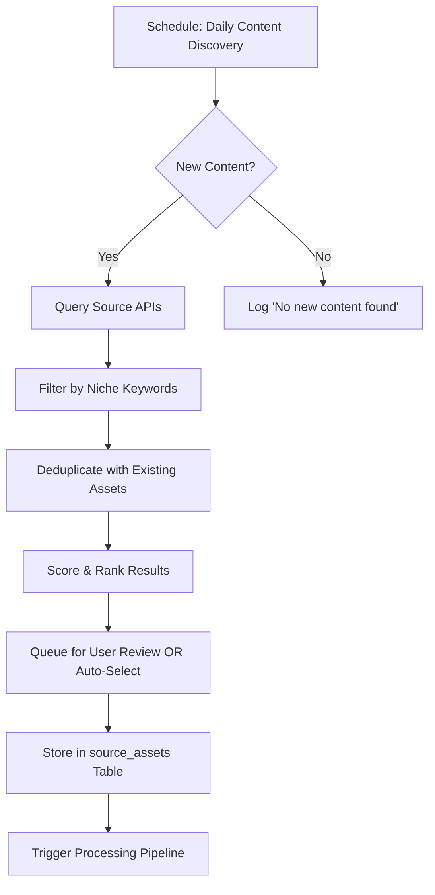
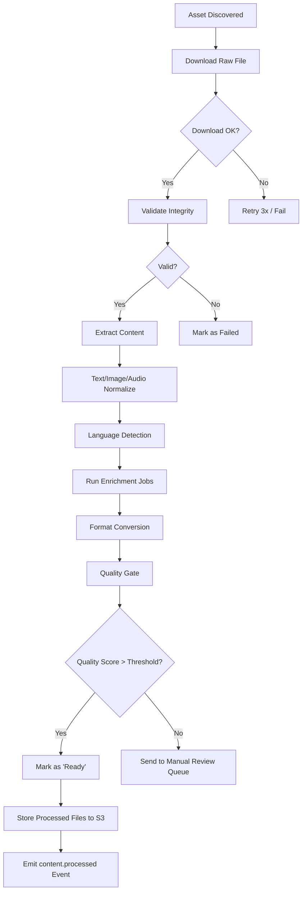

# Content Generation Pipeline

## 1. Overview

The Content Pipeline discovers public-domain content from multiple sources, processes it into sellable formats, and packages it with templates for marketplace distribution.

```
             DISCOVERY                    PROCESSING                  PACKAGING
               Phase                         Phase                      Phase

  ┌──────────────┐            ┌──────────────┐            ┌──────────────┐
  │ Source       │   Discover │ Raw Content  │   Convert  │ Processed    │
  │ Repositories │───────────▶│ Repository   │───────────▶│ Assets       │
  │ (External)   │            │ (S3 + DB)    │            │ (S3 + DB)    │
  └──────────────┘            └──────────────┘            └──────────────┘
        │                             │                           │
        ▼                             ▼                           ▼
  ┌──────────────┐            ┌──────────────┐            ┌──────────────┐
  │ Gutenberg    │            │ Text Normal  │            │ Template     │
  │ Wikimedia    │            │ OCR/Transc   │            │ Application  │
  │ Archive.org  │            │ Format Conv  │            │ Cover Gen    │
  │ LoC          │            │ Lang Detect  │            │ QA Check     │
  │ Musopen      │            │ AI Enrich    │            │ Metadata Inj │
  └──────────────┘            └──────────────┘            └──────────────┘
```

## 2. Content Sources

### 2.1 Source Registry

| Source | Code | Content Types | API/Access Method | Rate Limit |
|--------|------|---------------|-------------------|------------|
| Project Gutenberg | `gutenberg` | Books (text, audio) | Gutenberg Drupal API + direct file downloads | 1000 req/hr |
| Wikimedia Commons | `wikimedia` | Images, audio, video | Wikimedia API | 200 req/min |
| Internet Archive | `archive_org` | Books, audio, video, software | Internet Archive API | 15 req/sec |
| Library of Congress | `loc` | Photos, maps, documents, audio | LoC API | No limit (respect robots.txt) |
| Musopen | `musopen` | Sheet music, recordings | Musopen API | 100 req/day (free) |
| PubMed Central | `pubmed` | Scientific articles | PMC OAI-PMH / FTP | 3 req/sec |
| Metropolitan Museum | `met_museum` | Art images, metadata | Met Collection API | 80 req/sec |
| Open Library | `open_library` | Book metadata, scans | Open Library API | 100 req/min |

### 2.2 Discovery Configuration

Each source has a connector that implements:

```typescript
interface ContentSourceConnector {
  readonly code: string;
  readonly name: string;
  
  // Configuration
  configure(config: SourceConfig): void;
  
  // Discovery methods
  search(query: SearchParams): Promise<SearchResult[]>;
  getById(sourceId: string): Promise<AssetMetadata>;
  getRelated(sourceId: string, limit: number): Promise<AssetMetadata[]>;
  
  // Download
  download(sourceId: string, format: string): Promise<Stream>;
  
  // Metadata
  getMetadata(sourceId: string): Promise<AssetMetadata>;
}
```

### 2.3 Niche Discovery Algorithm

The system doesn't just find random content — it discovers content relevant to the user's niche:

```
1. User specifies niche keywords (e.g., "philosophy", "victorian art", "classical piano")
2. System queries each source with niche terms
3. Results are deduplicated and scored:
   - Relevance score (keyword match density)
   - Quality score (source reputation, completeness)
   - Market demand score (search volume trends for similar content)
4. Top results presented to user (or auto-selected if configured)
5. System queues assets for download and processing
```

## 3. Processing Pipeline

### 3.1 Pipeline Stages

Each asset goes through a configurable processing pipeline:

```
[Download] → [Validate] → [Extract] → [Normalize] → [Enrich] → [Convert] → [Quality Gate]
```

### 3.2 Stage Details

#### Stage 1: Download
- Downloads raw content from source
- Stores in S3 with path: `raw/{source}/{source_id}/{filename}`
- Handles retries, timeouts, and partial downloads
- Stores checksum (SHA-256) for integrity verification

#### Stage 2: Validate
- Validates file integrity (checksum match)
- Checks format compatibility (is it actually a text file? valid image?)
- Scans for malware (file type validation, no executable code)
- Rejects corrupt or invalid files

#### Stage 3: Extract
- **For books/text**: Extract plain text from HTML, PDF, EPUB, or plain text
- **For images**: Extract embedded metadata (EXIF, IPTC, XMP)
- **For audio**: Extract ID3 tags (title, artist, album, year)
- **For archives**: Extract individual files from ZIP, TAR, RAR

#### Stage 4: Normalize
- **Text**: Unicode normalization (NFC), encoding detection + conversion, whitespace normalization
- **Images**: Color profile conversion (CMYK → sRGB), resizing to standard dimensions
- **Audio**: Normalize volume (EBU R128), convert sample rate to 44.1kHz
- Language detection and tagging

#### Stage 5: Enrich (AI-powered)
- **AI Summary**: Generate blurb/description using LLM
- **AI Tags**: Auto-generate relevant tags and categories
- **AI Translation**: Optional multi-language translation (premium feature)
- **AI Cover Generation**: Generate cover image using DALL·E / Stable Diffusion (opt-in)
- **AI Audio Narration**: Text-to-speech audiobook generation (premium feature)
- **Chapter detection**: Auto-detect chapter boundaries from text

#### Stage 6: Convert (Format Generation)
Generates one or more sellable formats:

| Input Type | Output Formats | Tools |
|-----------|---------------|-------|
| Book (text) | PDF, EPUB, MOBI, HTML | Pandoc, Calibre, WeasyPrint |
| Book (scanned) | PDF (OCR text layer), EPUB | Tesseract OCR + ABBYY |
| Image | PDF print-ready, JPG/PNG web, TIFF archival | ImageMagick, Pillow |
| Audio | MP3 (320kbps), FLAC, WAV | FFmpeg, LAME |
| Music (sheet) | PDF, MusicXML, MIDI | LilyPond, MuseScore CLI |
| Bundle | ZIP archive of multiple formats | Standard ZIP utility |

**Format conversion configuration per product type:**

```json
{
  "ebook": {
    "formats": ["pdf", "epub", "mobi"],
    "pdf_config": {
      "page_size": "A5",
      "margin": "1in",
      "font": "Georgia",
      "font_size": 11,
      "include_toc": true,
      "include_cover": true
    },
    "epub_config": {
      "stylesheet": "classic.css"
    }
  },
  "print_art": {
    "formats": ["pdf_print", "jpg_web"],
    "pdf_print": {
      "page_size": ["A3", "A4", "Letter"],
      "color_profile": "sRGB",
      "bleed_mm": 3,
      "dpi": 300
    }
  },
  "music_track": {
    "formats": ["mp3", "flac", "wav"],
    "mp3_config": {
      "bitrate": 320,
      "sample_rate": 44100
    }
  }
}
```

#### Stage 7: Quality Gate
- **Page count check**: Min/max pages for books
- **Rendering check**: Render PDF and verify no rendering errors
- **Content check**: Verify text extraction was successful (min word count)
- **Visual check**: For images — check resolution, color depth, no corruption
- **Accessibility check**: PDF tags, alt text on images (where possible)
- **Score**: 0.0 - 1.0 quality score; below threshold → manual review queue

### 3.3 Enrichment Jobs

Long-running or expensive operations are modeled as async jobs:

| Job Type | Description | Duration | AI Dep? |
|----------|-------------|----------|---------|
| `ocr` | OCR on scanned documents | 1-10 min | No |
| `transcription` | Audio-to-text for audiobooks | Real-time ratio | Opt |
| `translation` | Full text translation | 2-5 min/doc | Yes |
| `summary` | AI-generated blurb | 10-30 sec | Yes |
| `cover_gen` | AI cover image generation | 5-15 sec | Yes |
| `tagging` | Auto-tagging and categorization | 5-20 sec | Yes |
| `chapter_detect` | Automatic chapter boundary detection | 1-5 sec | No |
| `tts_audio` | Text-to-speech audiobook | 30-120 min | Yes |

Jobs are processed by a worker pool (see Tech Stack section).

## 4. Template System

### 4.1 Template Types

| Template | Purpose | Format |
|----------|---------|--------|
| Book cover | Front cover + spine + back | SVG/CSS with variable injection |
| Book interior | Page layout, header/footer, TOC | CSS for print + HTML |
| Art print frame | Visual border/frame for artworks | SVG |
| Landing page | Product landing page | HTML/CSS/JS |
| Email template | Email campaign layout | HTML |
| Social card | Quote card / promo image | SVG/CSS |

### 4.2 Template Variables

Templates use a simple `{{variable}}` syntax:

```
{{product.title}}
{{product.description}}
{{product.original_author}}
{{product.price}}
{{product.cover_image_url}}
{{product.file_urls.pdf}}
{{organization.name}}
{{organization.logo_url}}
{{organization.website}}
{{lead.first_name}} (for email templates)
{{unsubscribe_url}} (for email templates)
{{product.url}}
{{cta_button_text}}
{{cta_button_url}}
```

### 4.3 Built-in Templates

The system ships with:
- 5 book cover templates (classic, modern, minimalist, vintage, illustrated)
- 3 book interior layouts (classic, modern, wide)
- 5 landing page designs (clean, premium, dark, playful, minimal)
- 10 email templates (welcome, promotional, reminder, newsletter, re-engagement)
- Social media card templates (quote, product showcase, comparison, educational)

## 5. Workflow Orchestration

### 5.1 Discovery Workflow



### 5.2 Processing Workflow (DAG)



### 5.3 Packaging Workflow

```
Ready Asset → Apply Template (cover + interior)
  → Inject Metadata (title, author, attribution notice)
  → Generate All Requested Formats
  → Create Product Draft in Product Service
  → Emit product.created Event
```

## 6. Storage Architecture

### 6.1 S3 Bucket Structure

```
domine-content/
├── raw/
│   ├── gutenberg/{source_id}/{filename}
│   ├── wikimedia/{source_id}/{filename}
│   └── archive_org/{source_id}/{filename}
├── processed/
│   ├── pdf/{asset_id}/v{version}/{filename}
│   ├── epub/{asset_id}/v{version}/{filename}
│   └── mp3/{asset_id}/v{version}/{filename}
├── packages/
│   ├── ebook/{product_id}/{format}.{ext}
│   ├── print/{product_id}/{format}.{ext}
│   └── audio/{product_id}/{format}.{ext}
├── covers/
│   └── {product_id}/{variant}.{ext}
├── templates/
│   ├── book-cover/
│   ├── book-interior/
│   ├── landing-page/
│   └── email/
├── temp/
│   └── {job_id}/  (ephemeral processing workspace)
└── media/
    ├── social/
    └── lead-magnets/
```

### 6.2 Content-Addressable Storage

Files are stored with content-hash-based naming to enable deduplication:

```
path = f"{type}/{sha256[:2]}/{sha256[2:4]}/{sha256}/{filename}"
```

This ensures:
- Identical content from different sources is stored once
- Immutable references (if content changes, hash changes)
- Efficient caching and CDN distribution

## 7. Error Handling & Resilience

| Failure Mode | Handling |
|-------------|----------|
| Download timeout | Retry 3x with exponential backoff; mark asset as `failed` |
| Source API rate limit | Back off and retry; queue assets for later |
| Format conversion failure | Try alternative tool; if all fail, mark format as unavailable |
| Enrichment job timeout | Kill job, retry once, then skip enrichment for this asset |
| S3 write failure | Queue retry; alert devops if persistent |
| Template rendering error | Fall back to default template |

## 8. Legal Compliance

### 8.1 Public Domain Verification

Before processing any asset, the system verifies:

1. **Source declaration**: Does the source claim public domain status?
2. **Publication date**: Published before 1929 (US rule) or relevant country rule
3. **Author death date**: Author died 70+ years ago (Berne Convention)
4. **Source authority**: Is the source reliable for PD claims?
5. **License identifier**: Creative Commons Zero, Public Domain Mark, or explicit PD declaration

Assets that fail PD verification are flagged and require manual review.

### 8.2 Attribution Requirements

All repackaged products include:
- Original author/creator credit
- Source attribution (e.g., "Digitized by Project Gutenberg")
- Public domain notice: "This work is in the public domain"
- Any Creative Commons attribution as required

### 8.3 Territorial Restrictions

- US-only PD: Flag for US-only marketplaces
- Worldwide PD: Suitable for all marketplaces
- EU restrictions: Flag for EU compliance check
- Derivative works: New cover, formatting, and supplementary content may be copyrighted by the republisher